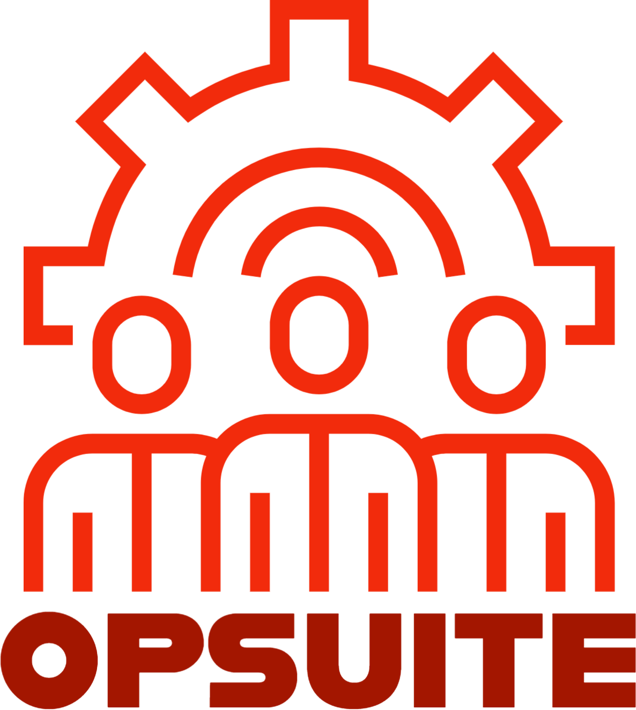

<div align="center">
    
</div>

# OpSuite

OpSuite aims to a be a suite of tools used for red team operations. It is written with a [Vue](https://vuejs.org/) frontend and a [FastAPI](https://fastapi.tiangolo.com/) backend, which allows for easy additional components to be written to the UI and additional web apps to be mounted onto the base FastAPI application.

This tool was heavily inspired by [Nextdoor's NDScheduler](https://github.com/Nextdoor/ndscheduler). However, this is a complete rewrite from scratch using a different stack to allow for modular growth.

## Getting Started

### Prerequisites

- Docker

### Installing

Installation is recommended via Docker. While OpSuite can be run locally without it, Docker makes management of resources much easier.

```
git clone https://github.com/daddycocoaman/OpSuite
docker-compose up
```

## Usage

OpSuite is divided into three parts:

- Frontend
- Backend
- Database

Running docker-compose will create a container for each part. The default username/password for the database is: `ops/opsuite`. OpSuite will expose port 9009 for the frontend, 9008 for the backend, and 5432 for the postgres db.

# Current Modules

<div align="center">
    
</div>

**AFISH** (Ay, Fam...I'm Still Here) is a scheduling tool used to run jobs. While it can be modified to run any sort of job, it is written with checking for existing persistence in mind. AFISH uses APScheduler to run jobs asynchronously as either a single run or with a cron-based trigger. These jobs are stored in the Postgres database which allows APScheduler to resume jobs in the case of any interruption.

**Current Job Modules**

- azure.ADUserPassCredential
- azure.ADClientSecretCredential

---

## Built With

- [FastAPI](https://fastapi.tiangolo.com/) - REST API framework
- [Vue](https://vuejs.org/) - The CLI Framework used
- [Postgres](https://www.postgresql.org/) - Backend DB
- [Vuetify](https://vuetifyjs.com/en/) - Vue Component Framework
- [APScheduler](https://apscheduler.readthedocs.io/en/stable/) - Scheduling Library

## Notes

**This project is being written as a project for Dakota State University's CSC-842 Security Tool Development course and may or may not be supported in the future!**

## License

This project is licensed under the MIT License - see the [LICENSE.md](LICENSE.md) file for details
